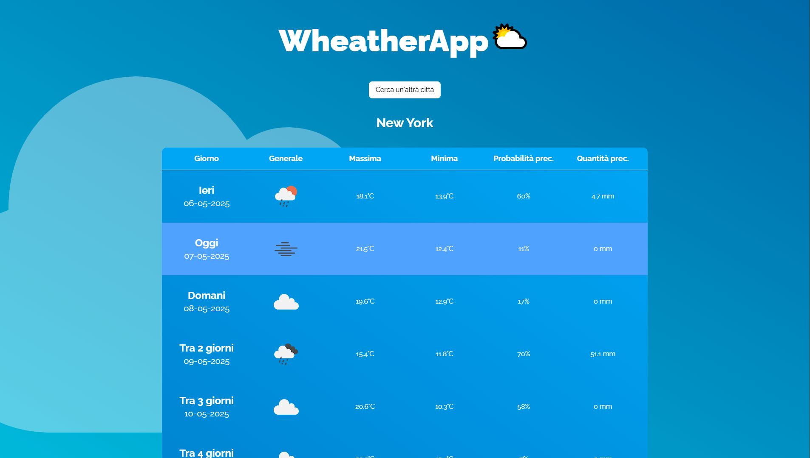

# Weather App

🌩 **Weather App** è un progetto realizzato per sperimentare l'integrazione di API di terze parti, offrendo un modo semplice per ottenere previsioni meteo in base alla posizione geografica.

🌍 Utilizza due API principali:

- **Geocoding API** per convertire un indirizzo in coordinate geografiche.
- **Weather API** per ottenere le previsioni meteo in base alle coordinate fornite.

## 📦 Tecnologie Utilizzate

- **React** per la logica e l'interfaccia utente.

- **Tailwind CSS** per uno stile moderno e reattivo.

- **Firebase** per il deploy automatico al push della repository.

- **React** per la logica e l'interfaccia utente.

- **Tailwind CSS** per uno stile moderno e reattivo.

## 🌐 Demo Online

Il sito è disponibile all'indirizzo: [Weather App](https://weatherapp-federicobellezza.web.app/)

## 🚀 Funzionalità

- Inserisci un indirizzo e ottieni le previsioni meteo in tempo reale.
- Visualizzazione grafica delle condizioni atmosferiche.
- Interfaccia responsive per una perfetta esperienza su tutti i dispositivi.
